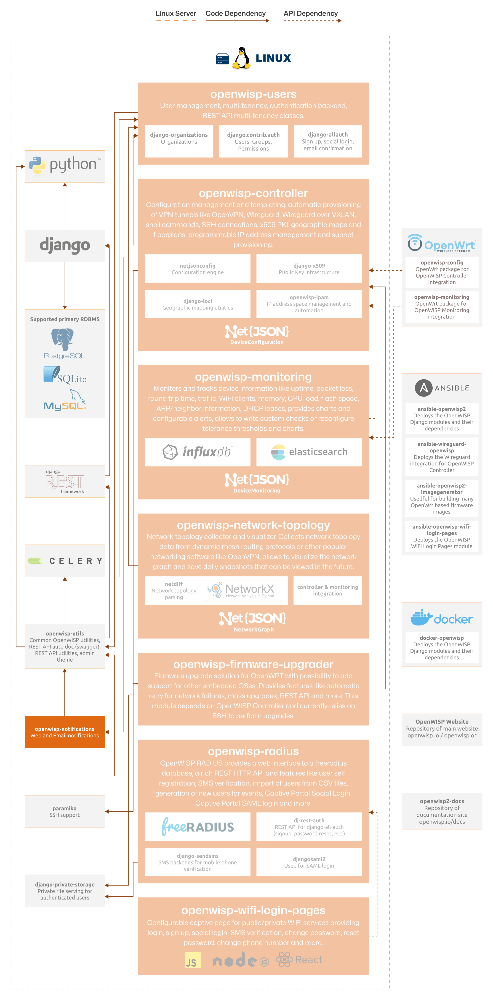

Notifications
=============

.. seealso::

    **Source code**: `github.com/openwisp/openwisp-notifications
    <https://github.com/openwisp/openwisp-notifications>`_.

OpenWISP Notifications is a versatile system designed to deliver email and
web notifications. Its primary function is to enable other OpenWISP
modules to alert users about significant events occurring within their
network. By seamlessly integrating with various OpenWISP components, it
ensures users are promptly informed about critical updates and changes.
This enhances the overall user experience by keeping network
administrators aware and responsive to important developments.

For a comprehensive overview of features, please refer to the
:doc:`user/intro` page.

The following diagram illustrates the role of the Notifications module
within the OpenWISP architecture.

    **OpenWISP Architecture: highlighted notifications module**

.. important::

    For an enhanced viewing experience, open the image above in a new
    browser tab.

    Refer to :doc:`/general/architecture` for more information.

.. toctree::
    :caption: Notifications Usage Docs
    :maxdepth: 1

    ./user/intro.rst
    ./user/notification-types.rst
    ./user/sending-notifications.rst
    ./user/web-email-notifications.rst
    ./user/notification-preferences.rst
    ./user/scheduled-deletion-of-notifications.rst
    ./user/rest-api.rst
    ./user/settings.rst
    ./user/management-commands.rst

.. toctree::
    :caption: Notifications Developer Docs
    :maxdepth: 2

    Developer Docs Index <developer/index.rst>
